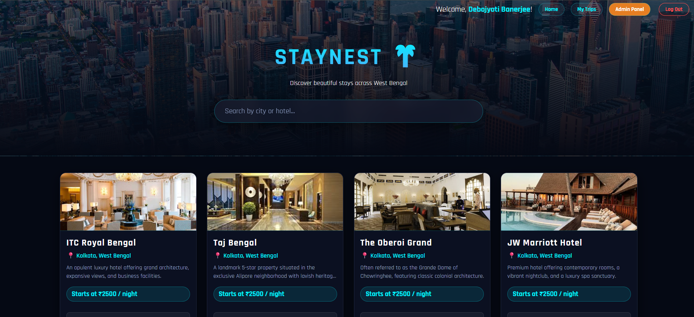
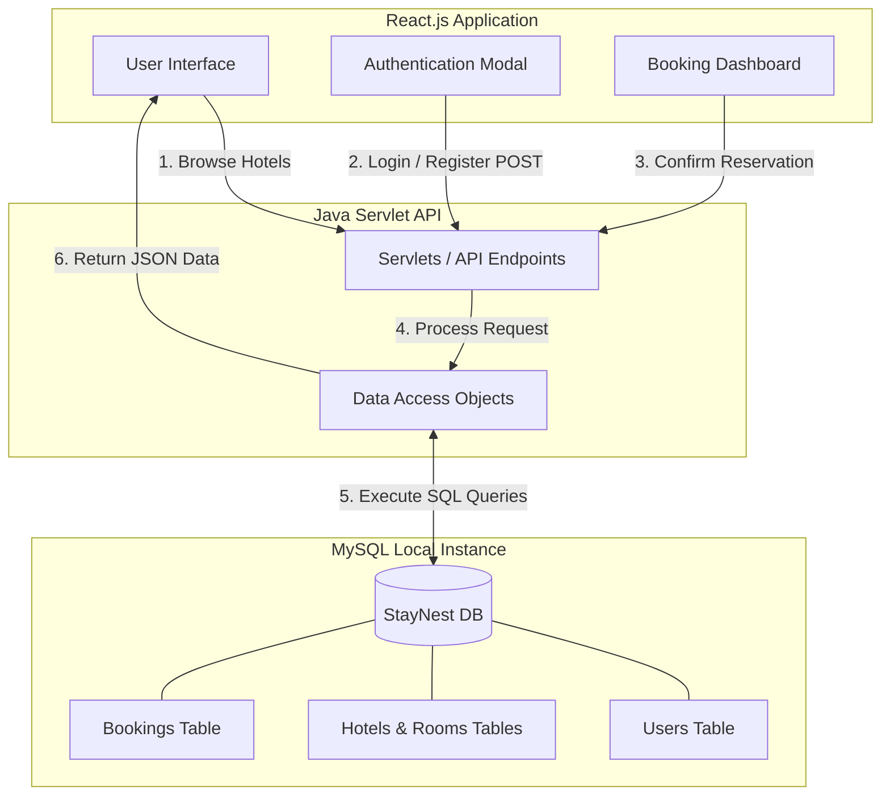

# 🌴 StayNest: Luxury Hotel Booking Platform

> A full-stack luxury hotel booking application built with React, Java Servlets, and MySQL. Features a highly responsive futuristic neon-dark UI, real-time room availability tracking, and a comprehensive booking management dashboard.

## ✨ Key Features
* **Futuristic UI/UX:** Glassmorphism design elements, neon hover effects, and a responsive CSS Grid layout built purely with modern CSS.
* **Dynamic Search & Filtering:** Instantly filter hotel listings and view detailed property amenities.
* **Secure Booking System:** Date-picker integration and room selection with real-time price calculation.
* **Admin Dashboard:** Real-time tracking of pending, confirmed, and cancelled bookings.
* **Optimized Database:** Fully normalized MySQL relational database utilizing `JOIN` queries and `TIMESTAMP` tracking for maximum data integrity.

## 📸 Screenshots




## 💻 Tech Stack
* **Frontend:** React.js, JavaScript (ES6+), CSS3 (Flexbox/Grid)
* **Backend:** Java (Servlets, DAO Pattern), Apache Tomcat
* **Database:** MySQL, JDBC (`mysql-connector-j`)
* **Data Parsing:** Gson

## ⚙️ System Workflow


## 🛠️ Local Installation & Setup

This project uses a standard Java Dynamic Web Project architecture (non-Maven) paired with a modern React frontend.

### 1. Database Configuration
1. Open MySQL Workbench.
2. Execute the provided `.sql` files to generate the `StayNest` schema, tables, and mock data.
3. Update `DBConnection.java` with your local MySQL credentials.

### 2. Backend Setup (Java / Eclipse)
1. Import the Java folder into Eclipse as a **Dynamic Web Project**.
2. Ensure `gson-2.10.1.jar` and `mysql-connector-j-26.7.0.jar` are placed inside the `WebContent/WEB-INF/lib` folder.
3. Right-click the project -> **Run As** -> **Run on Server** (Select your local Apache Tomcat instance).

### 3. Frontend Setup (React / VS Code)
1. Open the frontend React folder in your terminal.
2. Install the necessary Node dependencies:
   ```bash
   npm install
   ```
3. Start the React development server:
   ```bash
   npm start
   ```
4. The application will launch at `http://localhost:3000`.

---
**Developed by Debojyoti Banerjee**
